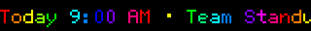
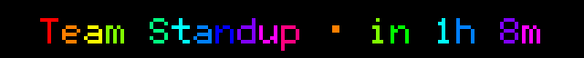

# led-ticker-calendar

Calendar widget for [led-ticker](https://github.com/JamesAwesome/led-ticker) — displays upcoming events from any `.ics` feed as a rotating agenda, a live next-event countdown, or per-event two-row cards.





## Prerequisites

- A working [led-ticker](https://github.com/JamesAwesome/led-ticker) install.
- A public `.ics` URL (Google Calendar "Secret address in iCal format", iCloud shared calendar link, or an Outlook/Office365 ICS link) — or a local `file://` path.

## Install

This plugin auto-registers via the `led_ticker.plugins` entry point — once the package is installed, no `[plugins]` config change is needed.

**Into a containerized led-ticker (recommended):** the plugin is already listed in `config/requirements-plugins.example.txt`. Copy that to the live file and rebuild:

```bash
# in your led-ticker checkout
cp config/requirements-plugins.example.txt config/requirements-plugins.txt
docker compose up -d --build
```

That example file lists every first-party plugin — trim the live copy to just the ones you want. The calendar line is:

```text
git+https://github.com/JamesAwesome/led-ticker-calendar.git@main
```

For production use, pin to a tag or SHA rather than `@main`:

```text
git+https://github.com/JamesAwesome/led-ticker-calendar.git@v0.1.0
```

**Standalone (a venv that already has led-ticker):**

```bash
pip install "git+https://github.com/JamesAwesome/led-ticker-calendar.git@main"
```

led-ticker isn't on PyPI, so this path only works where led-ticker is already installed. See the led-ticker [Plugins docs](https://docs.ledticker.dev/plugins/) for the constraint-based install the Docker image uses.

Once installed, the `calendar.events` widget is available automatically.

## What it provides

One widget: `type = "calendar.events"` — an `.ics` feed subscriber with three layouts.

### Layouts

- **`layout = "agenda"` (default)** — one scrolling line per upcoming event. Two-tone: the time phrase (`Tomorrow 3:09 PM ·`) renders in `time_color`; the event title renders in `font_color`. Events matching `highlight` appear in `highlight_color` (both segments, whole-line attention state). Up to `max_events` events from the next `lookahead_days` days.
- **`layout = "next"`** — a single live countdown to the soonest event (`Standup · in 25m`, `Standup · now`). The countdown phrase ticks down live every display cycle. All-day events today show `· today`.
- **`layout = "two_row"`** — one card per event: the held top row shows the day + time (`Tomorrow 3:09 PM`); the scrolling bottom row shows the event title. Supports the `top_*` per-row knobs below.

The widget is a Container: a background task polls the feed at `update_interval`; the display loop re-reads `feed_stories` on every pass so updates surface within one cycle without restarting.

## Config

New to led-ticker configs? The [first-config tutorial](https://docs.ledticker.dev/tutorial/02-first-config/) walks through the overall structure. The blocks below show only the calendar-specific keys.

### Agenda (default)

```toml
[[playlist.section]]
mode = "swap"
content_height = 16
hold_time = 8

[[playlist.section.widget]]
type = "calendar.events"
ics_url = "https://calendar.google.com/calendar/ical/.../basic.ics"
layout = "agenda"
timezone = "America/New_York"
time_format = "12h"
max_events = 5
lookahead_days = 7
highlight = ["1:1", "interview"]
time_color = [0, 200, 255]
font_color = "rainbow"
```

### Two-row cards (bigsign)

The held day+time row can overflow at `default_scale = 4` (only 64 logical pixels wide). Drop to `scale = 2` to give each row more room, and use a smaller font:

```toml
[[playlist.section]]
mode = "swap"
scale = 2
content_height = 24
hold_time = 10

[[playlist.section.widget]]
type = "calendar.events"
ics_url = "https://calendar.google.com/calendar/ical/.../basic.ics"
layout = "two_row"
timezone = "America/New_York"
time_format = "12h"
max_events = 5
font = "Inter-Regular"
font_size = 16
font_threshold = 80
time_color = [255, 200, 60]
font_color = [255, 255, 255]
highlight = ["1:1", "interview"]
```

### Next (live countdown)

```toml
[[playlist.section]]
mode = "swap"
content_height = 16
hold_time = 20

[[playlist.section.widget]]
type = "calendar.events"
ics_url = "https://calendar.google.com/calendar/ical/.../basic.ics"
layout = "next"
timezone = "America/New_York"
font_color = [255, 255, 255]
time_color = "rainbow"
empty_text = "No upcoming events"
```

## Field reference

**`ics_url` is the only required field** — everything below is optional tuning.

| Option | Type | Default | Description |
|--------|------|---------|-------------|
| `ics_url` | string | **required** | Public `.ics` URL (e.g. Google Calendar "Secret address in iCal format"), `webcal://` link (auto-rewritten to `https://`), or a `file://` path for a local file (e.g. `"file:///home/pi/cal.ics"`). |
| `layout` | string | `"agenda"` | `"agenda"` — rotating event lines; `"next"` — live countdown to the soonest event; `"two_row"` — per-event card (held day+time on top, scrolling title below). |
| `max_events` | int | `5` | Maximum upcoming events to display in agenda and two_row modes. `0` means no cap. |
| `lookahead_days` | int | `7` | Days ahead to scan for events. Recurrence rules are expanded within this window (max 366). |
| `time_format` | string | `"12h"` | `"12h"` → `3:00 PM`; `"24h"` → `15:00`; or any `strftime` template string (e.g. `"%H:%M"`). |
| `timezone` | string | system local | IANA timezone name for display (e.g. `"America/New_York"`). Defaults to the system local timezone. |
| `empty_text` | string | `"No upcoming events"` | Text shown when the feed loads but has no events in the lookahead window. |
| `error_text` | string | `"Calendar unavailable"` | Text shown when the feed fails to load on the first attempt. Subsequent transient failures keep the last-good events instead. |
| `filter` | list of strings | `[]` | Keep only events whose summary contains any of these keywords (case-insensitive). Empty = all events. |
| `highlight` | list of strings | `[]` | Events matching any keyword render in `highlight_color` and are guaranteed to appear even if `max_events` would otherwise drop them. |
| `highlight_color` | RGB / string / table | amber `[255, 200, 60]` | Color for highlighted events (both the time phrase and title segments). Constant `[r,g,b]`, `"rainbow"`, `"color_cycle"`, `"random"`, or `{style="gradient", from=[...], to=[...]}`. |
| `font_color` | RGB / string / table | white `[255, 255, 255]` | Color for the **event title** on non-highlighted lines. Same provider forms as `highlight_color`. |
| `time_color` | RGB / string / table | amber `[255, 200, 60]` | Color for the **time / relative phrase** on non-highlighted lines (e.g. `Tomorrow 3:00 PM ·` in agenda, `· in 5m` in next). Set both `font_color` and `time_color` to the same value for a single-color line. |
| `bg_color` | RGB list | none | Background fill painted across the full panel before text. |
| `border` | string / table | none | Perimeter border ring — `"rainbow"`, `"color_cycle"`, `"lightbulbs"`, `[r,g,b]`, or an inline table. |
| `padding` | int | `6` | Horizontal padding (logical pixels) appended to each event line when scrolling. |
| `font` | string | `"6x12"` | BDF font (e.g. `"5x8"`, `"6x12"`) or hires font (e.g. `"Inter-Bold"`). In `two_row` mode the widget automatically substitutes `"5x8"` when the configured font is the default `"6x12"` (too tall for a split row); pick a fitting `font`/`font_size` for hires text. |
| `font_size` | int | none | Point size; required for a hires (TTF/OTF) `font`. |
| `font_threshold` | int | `128` | Hires anti-alias threshold (0–255); `80` suits Inter Regular. |
| `update_interval` | int | `900` | Seconds between feed fetches (default 15 minutes). |
| `top_row_height` | int | half the canvas | **two_row only.** Logical rows for the held top (day+time) band. The bottom (title) row takes the rest — must be less than the section's `content_height`. Omit for a 50/50 split. |
| `top_text_y_offset` | int | `0` | **two_row only.** Vertical nudge (logical pixels) for the top row's text. |
| `bottom_text_y_offset` | int | `0` | **two_row only.** Vertical nudge (logical pixels) for the bottom row's text. |

> `top_row_height`, `top_text_y_offset`, and `bottom_text_y_offset` apply only with `layout = "two_row"` — they are silently ignored under other layouts.

## Development

led-ticker isn't on PyPI, so this plugin resolves it from a sibling checkout. Clone both side by side:

```
~/projects/.../led-ticker
~/projects/.../led-ticker-calendar
```

```bash
uv sync --extra dev      # resolves led-ticker from ../led-ticker
uv run pytest -q
uv run ruff check src tests
```

The test suite needs the rgbmatrix stub on the path — `pyproject.toml` wires this automatically via `pythonpath = ["../led-ticker/tests/stubs"]`. To run tests manually without the project config:

```bash
PYTHONPATH=../led-ticker/tests/stubs uv run pytest -q
```

The plugin imports only the public `led_ticker.plugin` surface — `tests/test_import_purity.py` enforces it.

## Links

- [led-ticker](https://github.com/JamesAwesome/led-ticker) — the core project
- [Docs site](https://docs.ledticker.dev) · [Plugin system](https://docs.ledticker.dev/plugins/)
